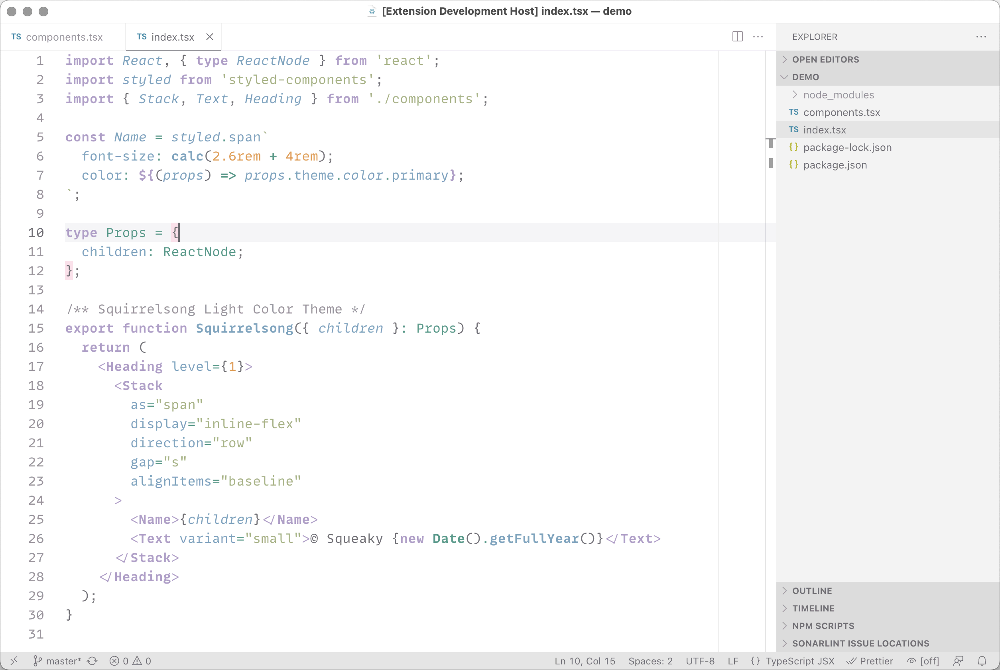
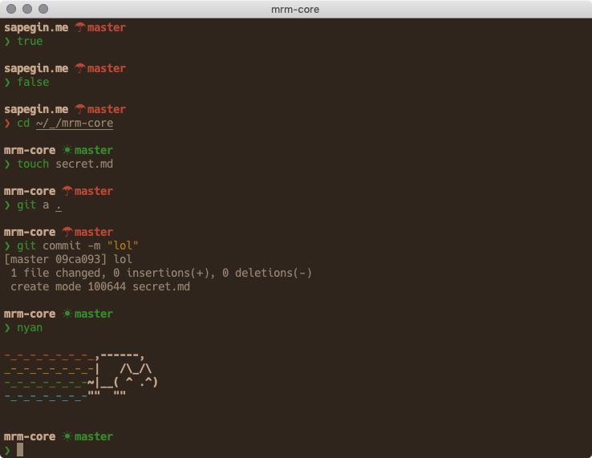

# Squirrelsong color themes

## Squirrelsong Light

[Download for Visual Studio Code or JetBrains](light)

## Squirrelsong Dark

[Download for Terminal.app or iTerm](dark)

---

You could also like [my dotfiles](https://github.com/sapegin/dotfiles).

## Author

- [Artem Sapegin](https://sapegin.me)

---

## License

The MIT License, see the included [License.md](License.md) file.
