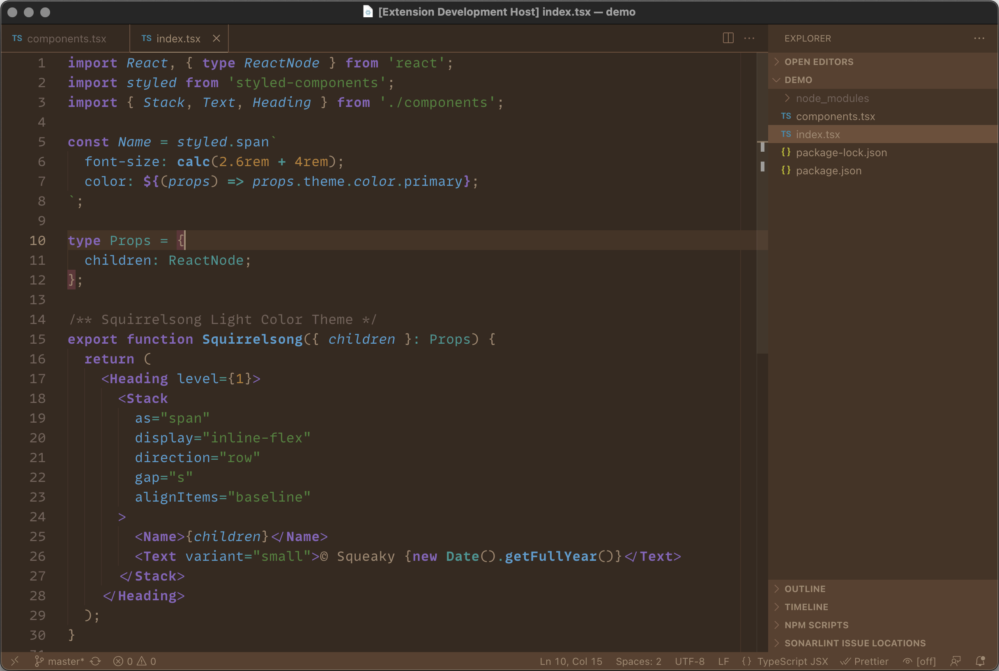

# Squirrelsong color themes

Low contrast light & dark themes for web developers.

- Low contrast with great readability
- Made for web developers
- Monochrome Markdown styles
- Consistent highlighting for different programming languages
- Non-distracting UI

## [Squirrelsong Light](light)

## [Squirrelsong Dark](dark)

---

You could also like [my dotfiles](https://github.com/sapegin/dotfiles).

## Sponsoring

Maintaining a color theme for multiple editors takes time and coffee, buy me one more cup to keep it going.

## Authors and license

[Artem Sapegin](https://sapegin.me) and [contributors](https://github.com/sapegin/squirrelsong/graphs/contributors).

The MIT License, see the included [License.md](License.md) file. Also see the [project status](https://github.com/sapegin/squirrelsong/discussions/4).

