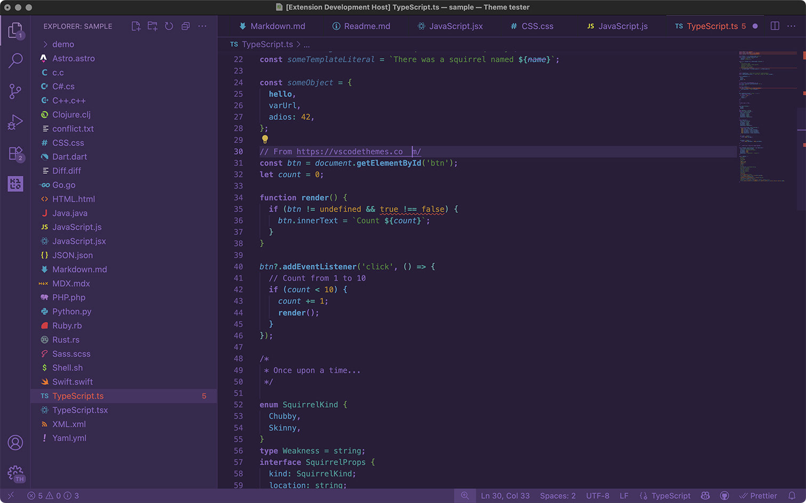

# Squirrelsong Dark color theme

## Available themes

- [Cursor](../themes/Cursor)
- [Fastmail](../themes/Fastmail)
- [Ghostty](../themes/Ghostty)
- [iTerm2](../themes/iTerm2)
- [Midnight Commander](../themes/Midnight%20Commander)
- [Pearcleaner](../themes/Pearcleaner)
- [Prism.js](../themes/PrismJs)
- [Slack](../themes/Slack)
- [Sublime Text](../themes/Sublime%20Text)
- [Terminal.app](../themes/Terminal)
- [Visual Studio Code](../themes/VSCode)
- [Warp](../themes/Warp)
- [WezTerm](../themes/WezTerm)

## Colors

<!-- palette:begin -->

| | Name | Hex | RGB |
| --- | --- | --- | --- |
|  | gray010 | #f3e2d3 | 243, 226, 211 |
|  | gray020 | #f0dbc7 | 240, 219, 199 |
|  | gray030 | #edd5be | 237, 213, 190 |
|  | gray040 | #dec8b1 | 222, 200, 177 |
|  | gray050 | #cfbaa5 | 207, 186, 165 |
|  | gray060 | #bfac99 | 191, 172, 153 |
|  | gray070 | #ad9c8b | 173, 156, 139 |
|  | gray080 | #9e8e7e | 158, 142, 126 |
|  | gray090 | #988571 | 152, 133, 113 |
|  | gray100 | #846d5c | 132, 109, 92 |
|  | gray110 | #725e4f | 114, 94, 79 |
|  | gray120 | #695444 | 105, 84, 68 |
|  | gray130 | #614d3d | 97, 77, 61 |
|  | gray140 | #5b4839 | 91, 72, 57 |
|  | gray150 | #4d3b2e | 77, 59, 46 |
|  | gray160 | #453327 | 69, 51, 39 |
|  | gray170 | #352a21 | 53, 42, 33 |
|  | gray180 | #292019 | 41, 32, 25 |
|  | purple010 | #f3e9fb | 243, 233, 251 |
|  | purple020 | #eee0fa | 238, 224, 250 |
|  | purple030 | #e9d6fa | 233, 214, 250 |
|  | purple040 | #d5beed | 213, 190, 237 |
|  | purple050 | #cbb5e3 | 203, 181, 227 |
|  | purple060 | #bea3d9 | 190, 163, 217 |
|  | purple070 | #ae95c7 | 174, 149, 199 |
|  | purple080 | #a88dc3 | 168, 141, 195 |
|  | purple090 | #9a7eb4 | 154, 126, 180 |
|  | purple100 | #856ab4 | 133, 106, 180 |
|  | purple110 | #7f61b3 | 127, 97, 179 |
|  | purple120 | #7254a6 | 114, 84, 166 |
|  | purple130 | #6c5492 | 108, 84, 146 |
|  | purple140 | #644e88 | 100, 78, 136 |
|  | purple150 | #503f6e | 80, 63, 110 |
|  | purple160 | #453461 | 69, 52, 97 |
|  | purple170 | #36294d | 54, 41, 77 |
|  | purple180 | #271e38 | 39, 30, 56 |
|  | green | #558240 | 85, 130, 64 |
|  | greenDim | #44603b | 68, 96, 59 |
|  | greenDimer | #445536 | 68, 85, 54 |
|  | greenContrast | #709855 | 112, 152, 85 |
|  | teal | #4f9593 | 79, 149, 147 |
|  | tealDim | #41635f | 65, 99, 95 |
|  | tealDimer | #3e5550 | 62, 85, 80 |
|  | tealContrast | #72aaa8 | 114, 170, 168 |
|  | blue | #5993c2 | 89, 147, 194 |
|  | blueDim | #425e79 | 66, 94, 121 |
|  | blueDimer | #3f5164 | 63, 81, 100 |
|  | blueContrast | #63a2d6 | 99, 162, 214 |
|  | magenta | #7f61b3 | 127, 97, 179 |
|  | magentaDim | #57427a | 87, 66, 122 |
|  | magentaDimer | #453461 | 69, 52, 97 |
|  | magentaContrast | #9672d4 | 150, 114, 212 |
|  | red | #ac493e | 172, 73, 62 |
|  | redDim | #703a2f | 112, 58, 47 |
|  | redDimer | #6c3b2f | 108, 59, 47 |
|  | redContrast | #ce574a | 206, 87, 74 |
|  | orange | #b18433 | 177, 132, 51 |
|  | orangeDim | #73572a | 115, 87, 42 |
|  | orangeDimer | #644c28 | 100, 76, 40 |
|  | orangeContrast | #d8a851 | 216, 168, 81 |
|  | yellow | #ceb250 | 206, 178, 80 |
|  | yellowDim | #87753d | 135, 117, 61 |
|  | yellowDimer | #7d683a | 125, 104, 58 |
|  | yellowContrast | #e2c358 | 226, 195, 88 |
|  | brightPink | #ca5a83 | 202, 90, 131 |
|  | brightPinkDim | #97576f | 151, 87, 111 |
|  | brightPinkDimer | #4d2e3a | 77, 46, 58 |
|  | brightYellow | #6a5444 | 106, 84, 68 |
|  | brightYellowDim | #574538 | 87, 69, 56 |
|  | brightYellowDimer | #41352a | 65, 53, 42 |
|  | brightYellowPurple | #5f4b86 | 95, 75, 134 |
|  | brightYellowDimPurple | #4c3c6b | 76, 60, 107 |
|  | brightYellowDimerPurple | #3f3259 | 63, 50, 89 |

<!-- palette:end -->

### Code colors

|                                                                                                           | Where                             | Color        | Hex     | Style  |
| --------------------------------------------------------------------------------------------------------- | --------------------------------- | ------------ | ------- | ------ |
|  | Punctuation                       | gray09       | #9e8e7e |        |
|  | Comment                           | gray06       | #6b503c |        |
|  | Keyword, tag name                 | purple       | #7f61b3 | Bold   |
|  | Number, boolean                   | orange       | #b18433 |        |
|  | Property, attribute name          | blue         | #5993c2 |        |
|  | Variable                          | blue         | #5993c2 | Italic |
|  | Function                          | blue         | #5993c2 | Bold   |
|  | String, attribute value, inserted | green        | #558240 |        |
|  | Type, namespace, colon            | teal         | #4f9593 |        |
|  | Class, at-rule, operator          | teal         | #4f9593 | Bold   |
|  | Regexp, deleted                   | red          | #ac493e |        |
|  | Important                         | red          | #ac493e | Bold   |
|  | URL                               | blueContrast | #63a2d6 |        |

### UI colors

|                                                                                                           | Where                     | Color            | Hex     | Comments |
| --------------------------------------------------------------------------------------------------------- | ------------------------- | ---------------- | ------- | -------- |
|  | Text foreground           | gray0a           | #ad9c8b |          |
|  | Text background           | gray02           | #292019 |          |
|  | Selection background      | brightYellowDim | #41352a |          |
|  | Line highlight background | gray04           | #453327 |          |

### ANSI colors

|                                                                                                           | Name           | Color          | Hex     |
| --------------------------------------------------------------------------------------------------------- | -------------- | -------------- | ------- |
|  | Black          | gray03         | #352a21 |
|  | Black bright   | gray06         | #6b503c |
|  | White          | gray0c         | #cfbaa5 |
|  | White bright   | gray0d         | #dec8b1 |
|  | Blue           | blue           | #5993c2 |
|  | Blue bright    | blueContrast   | #63a2d6 |
|  | Cyan           | teal           | #4f9593 |
|  | Cyan bright    | tealContrast   | #72aaa8 |
|  | Green          | green          | #558240 |
|  | Green bright   | greenContrast  | #709855 |
|  | Magenta        | purple         | #7f61b3 |
|  | Magenta bright | purpleContrast | #ae95c7 |
|  | Red            | red            | #ac493e |
|  | Red bright     | redContrast    | #ce574a |
|  | Yellow         | yellow         | #ceb250 |
|  | Yellow bright  | yellowContrast | #e2c358 |

---

Inspired by [Earthsong](http://daylerees.github.io/) Sublime Text scheme by [Dayle Rees](https://github.com/daylerees).
