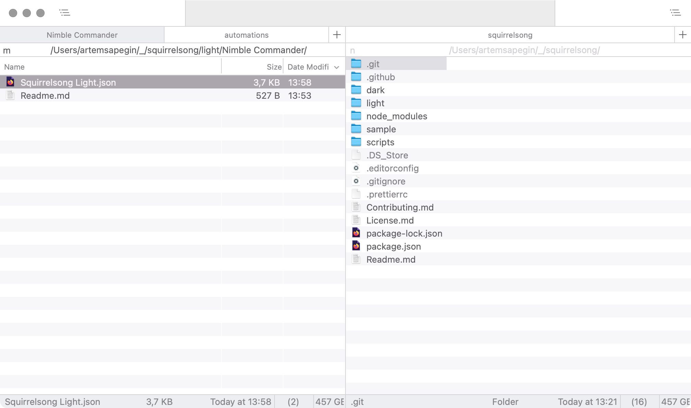

# Squirrelsong Light Theme for [Nimble Commander](https://magnumbytes.com/)

## Installation from GitHub

1. Download [Squirrelsong Light.json](Squirrelsong%20Light.json).
2. Open **Settings**, then **Themes**.
3. Open **Theme** dropdown at the bottom, and choose **Import theme...**.
4. Select `Squirrelsong Light.json`.
5. Select **Squirrelsong Light** in **Theme** list.
6. Open **Theme** dropdown at the bottom, and choose **Configure automatic switching...**.
5. Select **Squirrelsong Light** in **Light theme** dropdown.
