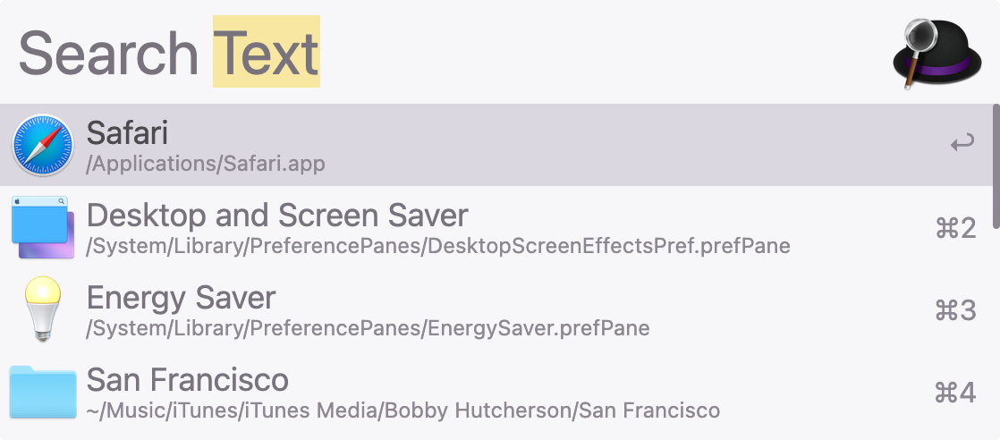

# Squirrelsong Light Theme for [Alfred](https://www.alfredapp.com/)

## Installation from Alfredapp.com

[Follow the instructions at Alfredapp.com](https://www.alfredapp.com/extras/theme/k74luGDhen/)

## Installation from GitHub

1. Download [`Squirrelsong Light.alfredappearance`](Squirrelsong%20Light.alfredappearance).
2. Open the downloaded file.
3. Confirm import in Alfred.
