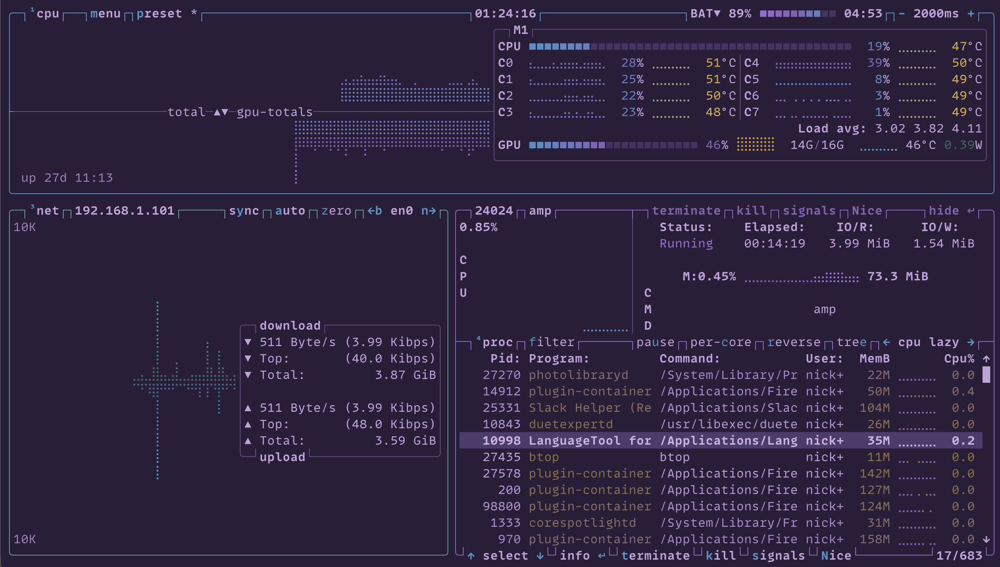

# Squirrelsong Theme for [btop](https://github.com/aristocratos/btop)



## Installation from GitHub

1. Copy the theme you want to your btop themes directory:

   - [`squirrelsong-light.theme`](./squirrelsong-light.theme)
   - [`squirrelsong-dark.theme`](./squirrelsong-dark.theme)
   - [`squirrelsong-dark-deep-purple.theme`](./squirrelsong-dark-deep-purple.theme)

   The btop themes directory is:

   - `$XDG_CONFIG_HOME/btop/themes`, if `$XDG_CONFIG_HOME` is set
   - `~/.config/btop/themes`, otherwise

2. Update your btop config:

```toml
color_theme = "squirrelsong-dark"
theme_background = true
truecolor = true
```
