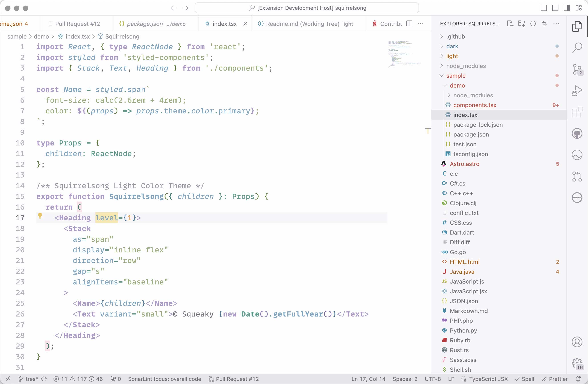
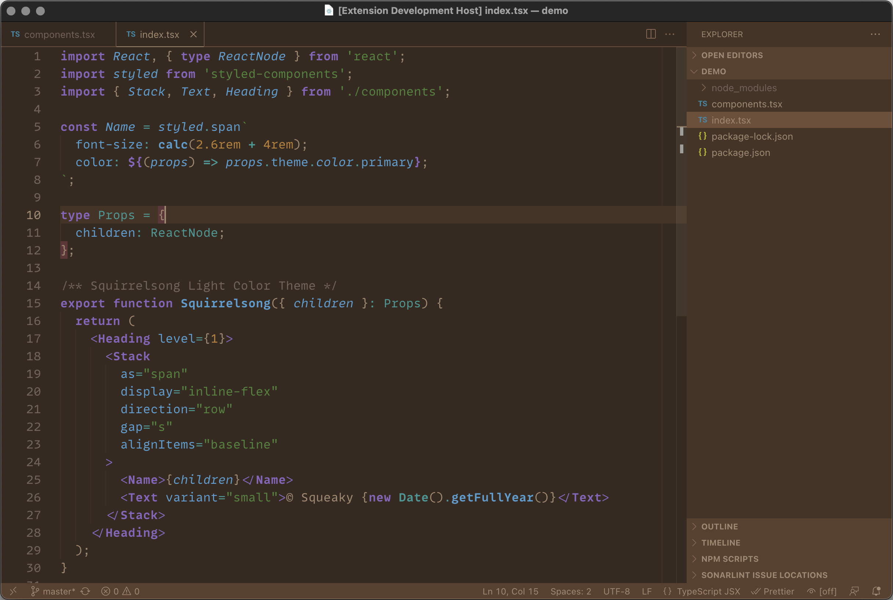

# Squirrelsong Light and Dark Themes for Cursor

The [Visual Studio Code theme](../VSCode/Readme.md) works for Cursor as well.

## Installation from Open VSX Registry

Follow the instructions: [light theme](https://open-vsx.org/extension/sapegin/Theme-SquirrelsongLight), [dark theme](https://open-vsx.org/extension/sapegin/Theme-SquirrelsongDark).
