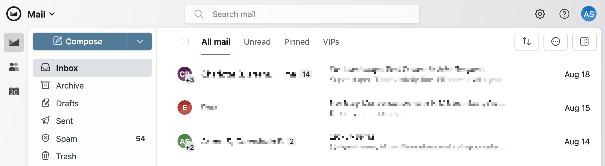
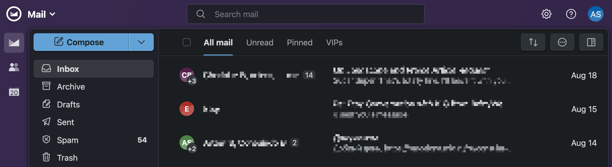

# Squirrelsong Light and Dark Deep Purple Themes for [Fastmail](https://fastmail.com/)





## Installation

1. Copy the values below:

   ```
   #f7f6f9,#527b98,#36294d,#63a2d6
   ```

2. Open **Settings → Display options** in Fastmail.
3. Paste the colors you copied from the previous step in the text field under **Copy these colors to save or share your theme. Paste to restore.**.
