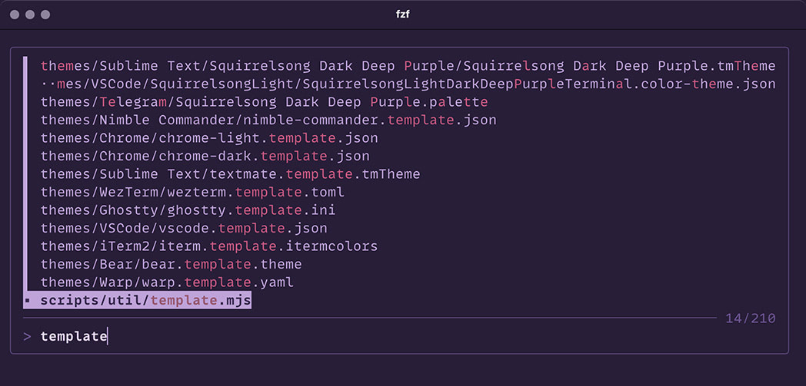

# Squirrelsong Dark Theme for [fzf](https://github.com/junegunn/fzf)



## Installing from GitHub

1. Add the following to your `~/.bashrc`, `~/.zshrc`, or any other file that your shell loads on startup.
   1. For Squirrelsong Dark theme:

<!-- apply:dark -->

```shell
export FZF_DEFAULT_OPTS='
  --color=fg:-1,fg+:#bfac99,bg:-1,bg+:#bfac99
  --color=hl:#ca5a83,hl+:#97576f,info:#695444,marker:#ceb250
  --color=prompt:#695444,spinner:#bfac99,pointer:#bfac99,header:#edd5be
  --color=border:#5b4839,label:#bfac99,query:#edd5be,disabled:#695444
  --border="rounded" --border-label="" --preview-window="border-rounded" --prompt="> "
  --marker=">" --pointer="▪︎" --separator="─" --scrollbar="│"
  --info="right"'
```

b. For Squirrelsong Dark Deep Purple theme:

<!-- apply:darkDp -->

```shell
export FZF_DEFAULT_OPTS='
  --color=fg:-1,fg+:#bea3d9,bg:-1,bg+:#bea3d9
  --color=hl:#ca5a83,hl+:#97576f,info:#7254a6,marker:#ceb250
  --color=prompt:#7254a6,spinner:#bea3d9,pointer:#bea3d9,header:#e9d6fa
  --color=border:#644e88,label:#bea3d9,query:#e9d6fa,disabled:#7254a6
  --border="rounded" --border-label="" --preview-window="border-rounded" --prompt="> "
  --marker=">" --pointer="▪︎" --separator="─" --scrollbar="│"
  --info="right"'
```

<!-- template
export FZF_DEFAULT_OPTS='
  --color=fg:-1,fg+:{{terminalForeground}},bg:-1,bg+:{{accent1}}
  --color=hl:{{accent2}},hl+:{{brightPinkDim}},info:{{terminalBrightBlack}},marker:{{terminalYellow}}
  --color=prompt:{{terminalBrightBlack}},spinner:{{accent1}},pointer:{{terminalForeground}},header:{{terminalBrightWhite}}
  --color=border:{{border}},label:{{accent1}},query:{{terminalBrightWhite}},disabled:{{terminalBrightBlack}}
  --border="rounded" --border-label="" --preview-window="border-rounded" --prompt="> "
  --marker=">" --pointer="▪︎" --separator="─" --scrollbar="│"
  --info="right"'
-->
