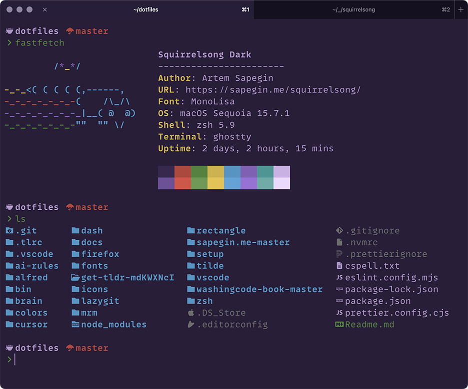

# Squirrelsong Dark Theme for [Ghostty](https://ghostty.org)




## Installation from GitHub

1. Copy the [`Squirrelsong Dark`](Squirrelsong%20Dark) or [`Squirrelsong Dark Deep Durple`](Squirrelsong%20Dark%20Deep%20Purple) to `~/.config/ghostty/themes`.

2. Update your Ghostty config, `~/.config/ghostty/ghostty`, so it looks something like this:

```ini
theme = Squirrelsong Dark
minimum-contrast = 1.1
macos-icon = custom-style
```
