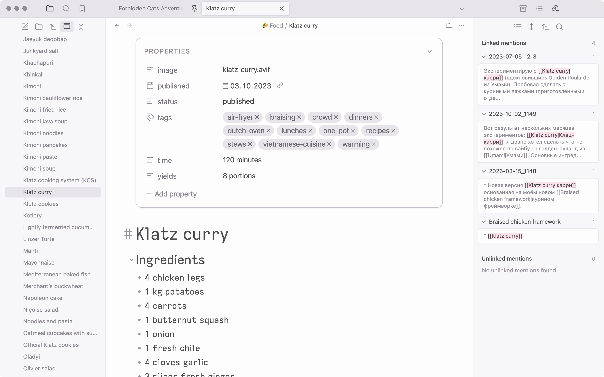
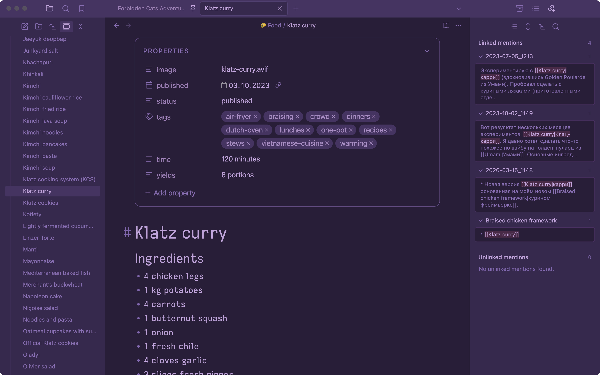

# Squirrelsong theme for [Obsidian](https://obsidian.md/)

## Installation from GitHub

1. Open Obsidian settings → **Appearance**.
2. In the **Themes** section select **Open themes folder** (folder icon on the right side).
3. Copy the [`Squirrelsong`](Squirrelsong) folder to the Obsidian `themes` folder.
4. Select `Squirrelsong` in the dropdown on the **Themes** section in Obsidian Appearance settings.
