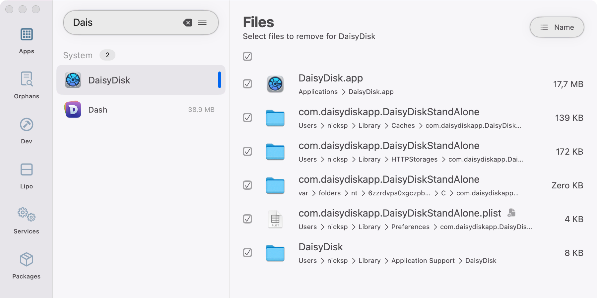
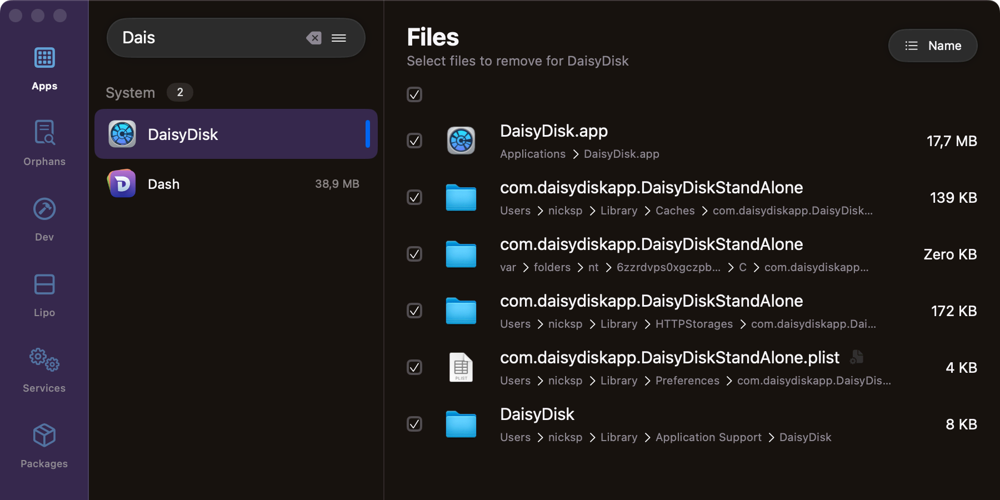

# Squirrelsong Light and Dark Deep Purple Themes for [Pearcleaner](https://itsalin.com/appInfo/?id=pearcleaner)





## Installation

1. Copy the values below for the light theme:

   ```
   #f7f6f9, #e8e5eb, #4c4b4e, #4c4b4e, #527b98
   ```

   Or these values for the dark theme:

   ```
   #17120e, #36294d, #f7f6f9, #8c8792, #63a2d6
   ```

2. Open **Settings → Interface** in Pearcleaner.
3. Paste the colors you copied from the previous step in the **Color String** text field under **Theme** section.
