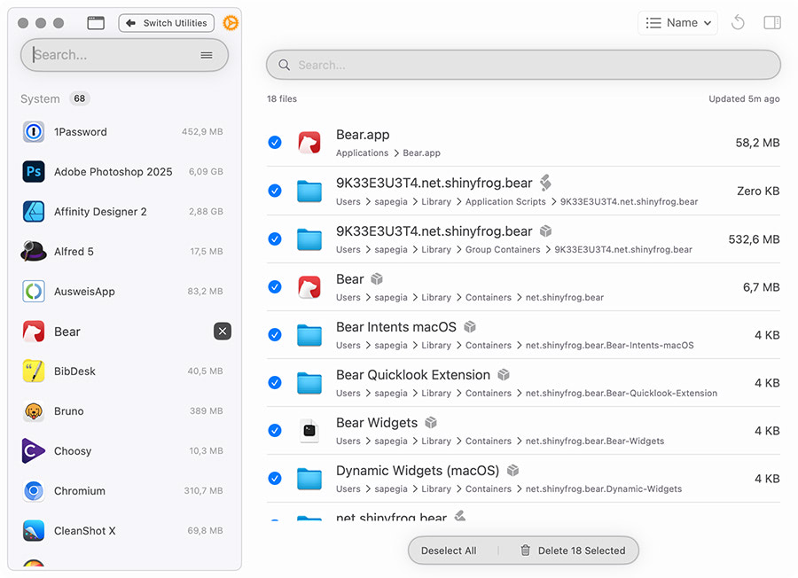
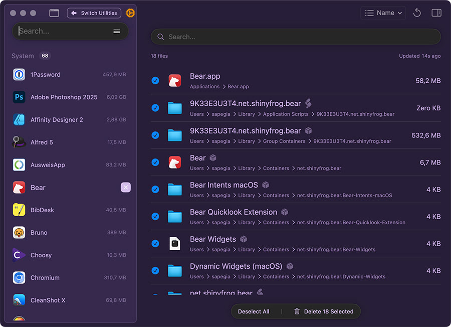

# Squirrelsong Light and Dark Deep Purple Themes for [Pearcleaner](https://itsalin.com/appInfo/?id=pearcleaner)





<!-- template: ${textBackground}, ${uiBackground}, ${titleForeground}, ${textForeground}, ${accent} -->

## Installation

1. Copy the values below for the light theme:

   ```
   #fdfdfe, #f7f6f9, #4c4b4e, #78737d, #4c4b4e
   ```

   Or these values for the dark theme:

   ```
   #271e38, #36294d, #bea3d9, #9a7eb4, #d5beed
   ```

2. Open **Settings → Interface** in Pearcleaner.
3. Paste the colors you copied from the previous step in the **Color String** text field under **Theme** section.
