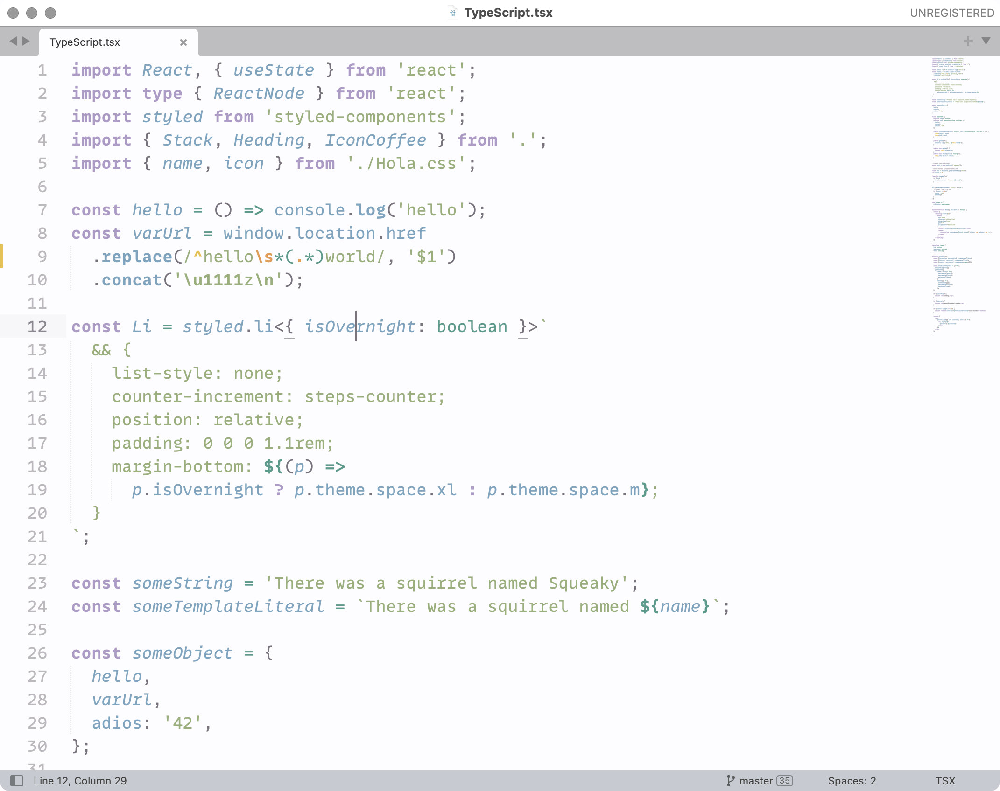
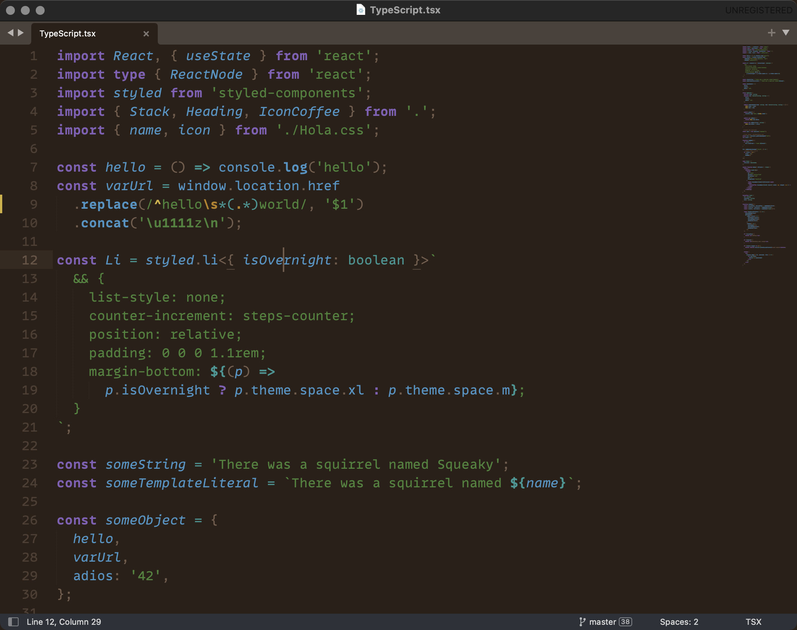
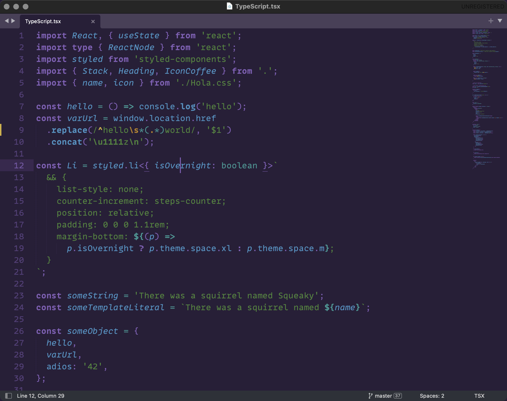

# Squirrelsong Light and Dark Theme for [Sublime Text](https://www.sublimetext.com/)

## Installation from GitHub

1. Clone the repository or [download as a ZIP archive](https://github.com/sapegin/squirrelsong/archive/refs/heads/master.zip).
2. Unzip the files.
3. Select **Preferences → Browse Packages** to open your Sublime Text packages directory.
4. Copy the `themes/Sublime Text/Squirrelsong Light` or `themes/Sublime Text/Squirrelsong Dark` folder into your Sublime Text packages directory.
5. Go to **Preferences → Color Scheme → User** and select the **Squirrelsong Light**, **Squirrelsong Dark**, or **Squirrelsong Dark Deep Purple** theme.
