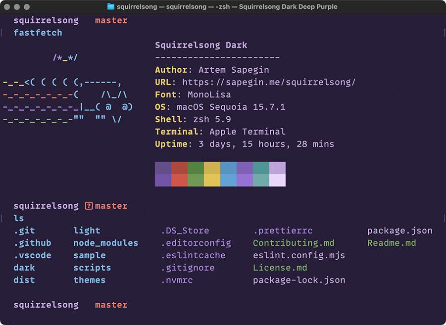

# Squirrelsong Dark Theme for Terminal.app

> [!NOTE]  
> Colors in Terminal.app looks brighter than they should because Terminal.app does color conversion that you cannot disable.

## Installation from GitHub

1. Download [`Squirrelsong Dark.terminal`](Squirrelsong%20Dark.terminal).
2. Open **Settings**, then **Profiles**.
3. Press the button with three dots at the bottom of the sidebar, and choose **Import**.
4. Select `Squirrelsong Dark.terminal`.
5. Select **Squirrelsong Dark** in the sidebar.
6. Select **Default** next to it.
