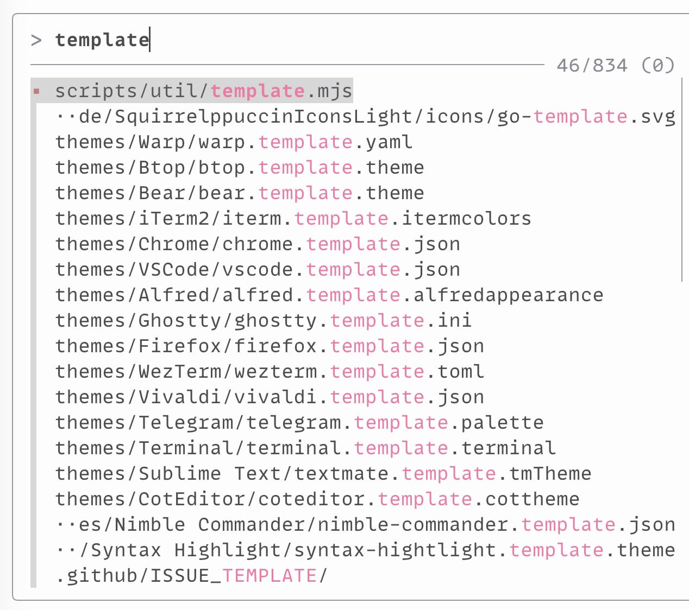

# Squirrelsong themes for Zsh




## [fzf](https://github.com/junegunn/fzf)

### Installing from GitHub

1. Copy [fzf-squirrelsong-light.sh](./fzf/fzf-squirrelsong-light.sh) or [fzf-squirrelsong-dark.sh](./fzf/fzf-squirrelsong-dark.sh) to your dotfiles.
2. Add the following to your `~/.bashrc`, `~/.zshrc`, or any other file that your shell loads on startup.

   ```shell
   case $TERM_THEME in
   light) source fzf-squirrelsong-light.sh ;;
   *) source fzf-squirrelsong-dark.sh ;;
   esac
   ```

3. Reference in your `FZF_DEFAULT_OPTS` setup:

   ```shell
   export FZF_DEFAULT_OPTS="--color '$FZF_COLORS'"
   ```

## [zsh-patina](https://github.com/michel-kraemer/zsh-patina)

ANSI theme that follows the terminal palette in light and dark Squirrelsong themes:

- [patina-squirrelsong.toml](./patina/patina-squirrelsong.toml)

### Installing from GitHub

1. Install zsh-patina (`brew tap michel-kraemer/zsh-patina && brew install zsh-patina`).
2. Copy the theme file to your dotfiles.
3. Point zsh-patina at it in `~/.config/zsh-patina/config.toml`:

```toml
[highlighting]
theme = "file:~/dotfiles/colors/patina-squirrelsong.toml"
```

4. Activate at the end of `.zshrc`:

```shell
eval "$(zsh-patina activate)"
```
