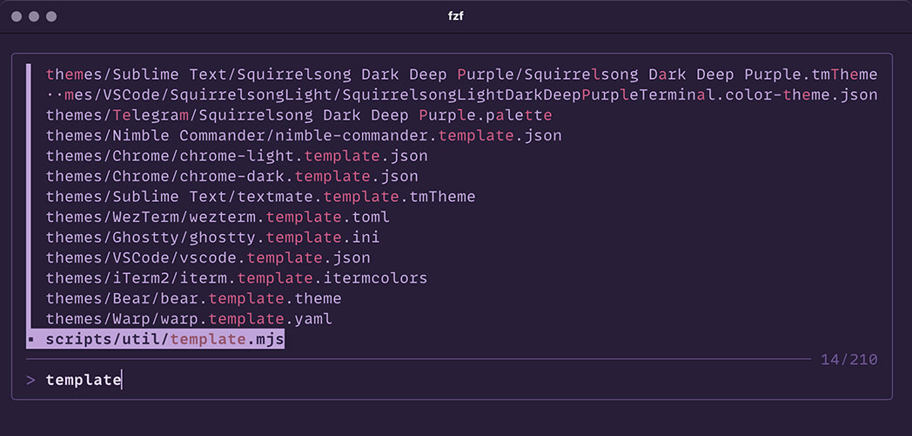

# Squirrelsong themes for Zsh



## [fzf](https://github.com/junegunn/fzf)

### Installing from GitHub

1. Copy [fzf-squirrelsong-dark.sh](./fzf-squirrelsong-dark.sh) or [fzf-squirrelsong-dark-dp.sh](./fzf-squirrelsong-dark-dp.sh) to your dotfiles.
2. Add the following to your `~/.bashrc`, `~/.zshrc`, or any other file that your shell loads on startup.

```shell
source fzf-squirrelsong-dark.sh
```

## [zsh-fast-syntax-highlighting](https://github.com/zdharma-continuum/fast-syntax-highlighting)

### Installing from GitHub

1. Copy [fast-syntax-highlighting-squirrelsong.ini](./fast-syntax-highlighting-squirrelsong.ini) to your dotfiles.
2. Load the plugin, then apply the theme:

```shell
source $(brew --prefix zsh-fast-syntax-highlighting)/share/zsh-fast-syntax-highlighting/fast-syntax-highlighting.plugin.zsh
fast-theme /path/to/fast-syntax-highlighting-squirrelsong.ini
```
